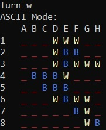
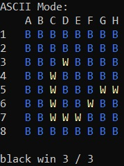

# Reversi
Advanced C project using socket and artificial intelligence with an Alpha-Beta pruning.

## Context 

In order to go further in our knowledge of embedded systems, we have taken the course of Advanced C programming where we have been assigned to designed and developed a game of Reversi online (using socket). Each group had to choose between the game master (which established connection between the two next), game controler (which display the matrix) and client player (which represent one player).

Our original objective for this project was to build the game master of a Reversi game also know as Othello.

Moreover, to test our GameMaster we created one GameControler and two ClientPlayer (one for white player and one for black player, why did we not used the same? We'll explain that later ;)). 
Each CLientPlayer include an Artificial Intelligence using alpha-beta pruning with MinMax (but they are not the same). We decided to implement two evaluative function relatively similar, for each program. More information about the design of the project [here](reversi.pdf).

This Artificial Intelligence (which is in ClientPlayerBP) allowed us to win all our match during the tournament organized by Mr. Houelle : indeed we obtain a win/lose ratio of 100% (8 wins - 0 lose) with on average 80% of the pawns of the matrix. We can see 7 to 8 moves in advance but in the code we prefer to see only 5 to 6 moves in advance because it is 30 times faster. It is our evaluative function that takes a lot of time because it sees one more move in advance (in fact 5 or 6 + 1 move). 

## Authors

* **Morgane Pigny** - *Initial work* - [LinkedIn](https://www.linkedin.com/in/morganepigny/)
* **Fabien Roussel** - *Initial work* - [GitHub](https://github.com/FabienRoussel) [LinkedIn](https://www.linkedin.com/in/fabien-roussel/)

## Rules and constraints

In a few words, the goal of a Reversi player is to maximise the number of pawns of his color in a 8 x 8 matrix. You must surround pawns of the opposite color with yours and each turn you need take pawns of your opponent else you pass.

If you want to know more about the game Reversi, please refer to the [wikipedia page](https://en.wikipedia.org/wiki/Reversi).

You will also find the guideline for designing the connection and the exchange of information between the ClientPlayer, GameControler and GameMaster. However, for more details about our choices of conception and other explanation, please refer to the section `Apha Beta Pruning algorithm`



## Getting Started
### Prerequisites

This project was created and developped with CodeBlocks.

### Installing

First step begins by cloning the project with :
```
git clone https://github.com/FabienRoussel/Reversi
```

As you can see you have 5 projects in your repository:
* `ArtificialIntelligence` which includ the complete Artificial Intelligence if you want to see the AI fully working without having to compile each project. Indeed this is the quickest way to see the result on your screen by compiling this project which use the **best Alpha-Beta pruning** we've created so far. **It is the project we recommend** you to test because it very easy and work on all OS.
* `ClientPlayer` is the first version of the client player including a good (not the best) Alpha-Beta pruning.
* `ClientPlayerBP` most advance automated client player with the **best Alpha-Beta pruning** (same as `ArtificialIntelligence` project).
* `GameControler` is a very simple project displaying a matrix in the terminal after it have extablished a connection with the game .
* `GameMaster` which allow communication between game controler and 2 client player.

To open a project, open CodeBlocks and click on `File` then `open` or press `ctrl`+`o`. Choose the .cbp file of the project you want to try and click on open. 

## Apha Beta Pruning algorithm

When you are playing chess, checkers or Reversi, you are constantly asking yourself **"how will my adversary respond?"** and this is where Apha Beta Pruning algorithm interesting. In **Game theory**, this type of algorithm is called **adversarial search**. Maximising our score is equal to minimizing our opponent score.

The Apha Beta Pruning keeps two values (alpha and beta) which represent (respectively) the minimum score that the maximizing player is insured and the maximum score that the minimizing player is insured. The initial call of the alpha beta pruning algorithm is with alpha equal to negative infinity and beta equal to positive infinity which means, each player start with their worst possible score. When the maximum (beta) score that the player minimizing is assured to become lower than the minimum score that the player maximizing (alpha) is assured ( i.e. Beta <= alpha), the player does not need to consider other descendants of this node because they will never be reached in the actual game (branch pruning).

pseudo code :
```
function AlphaBetaPruning(node, depth, alpha, beta, maxPlayer) :
    if depth == 0 or node is a terminal node :
        return the evaluative function value of node
    if maxPlayer :
        value = −∞
        for childNode in node :
            value = max(value, alphabeta(childNode, depth − 1, alpha, beta, False))
            alpha = max(alpha, value)
            if alpha >= beta :
                break 
        return value
    else
        value = +∞
        for childNode in node :
            value = min(value, alphabeta(childNode, depth − 1, alpha, beta, True))
            beta = min(beta, value)
            if alpha >= beta :
                break 
        return value
```

## Evaluative Function

Well, an Apha Beta Pruning must use a great Evaluative Function (some may say heuristic) in order to mesure how good/bad a node is.

More information next commit ...


